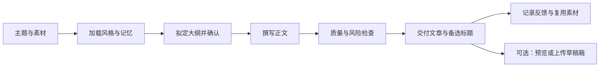

# 文章写作skill

面向微信公众号与长文创作者的 AI 写作工作流，将选题、结构设计、风格学习、素材复用、质量检查和交付整理为可复用的 Skill。

适合持续运营公众号的个人创作者、内容编辑与小型团队。你提供主题、观点或素材，AI 按既定流程协助完成文章，并将可复用经验保存在本地文件中。

**正式分发版本：v1.0.2** · [版本下载](https://github.com/zhuy3075-ui/article-writing-skill/releases/tag/v1.0.2) · [使用指南](docs/USER_GUIDE.md) · [工作流说明](WORKFLOW.md)

## 解决哪些问题

| 常见问题 | 对应能力 |
| --- | --- |
| 素材很多，难以确定文章切入点 | 梳理主题、选题角度与结构，先确认大纲再写正文 |
| AI 文章套话多，语气与自己的账号不一致 | 使用风格档案约束表达，并通过规则检查定位需要修改的段落 |
| 每次写作都要重复解释偏好 | 用本地记忆文件记录读者画像、反馈、标题与素材 |
| 写完还要整理标题、摘要和不同输出格式 | 按工作流准备交付内容，脚本支持 Markdown、JSON 与微信直贴文本 |
| 发布后缺少复盘依据 | 根据用户提供的阅读与互动数据形成改进建议 |

## 差异化优势：为持续创作积累可复用资产

本项目的重点是**将你的写作风格、素材和修改反馈持续沉淀，供下一篇文章复用**。对需要长期维护个人表达和账号内容的创作者，以下能力可以在同一套目录中协作：

1. **风格可分开管理**：独立 `styles/` 档案、默认表达设定和风格锁定规则，可按主题切换表达，减少不同参考风格互相影响。
2. **素材可跨文章复用**：用 `memory/` 分开保存选题、标题、金句、素材、读者画像与反馈，支持 CSV 导出，便于检索和迁移。
3. **反馈可进入下一轮写作**：工作流区分全局偏好、特定风格偏好和偶发修改，并根据用户提供的效果数据形成复盘动作。
4. **检查结果可追踪**：质量脚本输出具体特征与评分，便于定位套话、来源痕迹和节奏问题，再做定向修改。
5. **从写作逐步接入交付**：先使用主题、模板和风格完成文字创作，再按需要启用格式转换、微信预览、配图与草稿箱工具。

### 与代表性开源项目的定位对比

以下基于 2026-10-07 阅读的公开 README 与目录结构，比较设计重点；未使用统一测试集测量生成质量、效率或稳定性。

| 项目 | 公开文档强调的能力 | 本项目的相对侧重 |
| --- | --- | --- |
| [yaoleifly/wechat-writing-style](https://github.com/yaoleifly/wechat-writing-style) | 面向公众号的表达规范、短段落、审查流程和备选标题 | 在写作规则之外，提供独立风格库、本地素材记忆、反馈分类与辅助脚本 |
| [JamYang-cloud/wechat-article-writing](https://github.com/JamYang-cloud/wechat-article-writing) | 源材料覆盖、读者定位、结构变体、质检门、移动端视检与发布方法论 | 用多类模板、风格档案和本地记忆组织日常创作，并附带格式转换和草稿上传脚本 |
| [843645440/wechat-skill](https://github.com/843645440/wechat-skill) | 写作与排版流水线、12 套排版主题、HTML 校验、多账号草稿 | 把作者表达、范文学习、素材积累和反馈复用放在写作主流程中；写作资料可集中在一个 Skill 目录内管理 |

**适合选择本项目的场景**：你反复写同一领域，需要保持自己的语气、复用已有素材，并把修改意见带到后续创作中。

若需求主要是精细 HTML 主题、多账号草稿编排或严格移动端渲染验收，上述项目有更明确的专门设计。当前项目的优势是创作资产的组织与复用机制，实际效果取决于模型、输入素材与记忆维护。

## 功能范围

- **文章结构**：提供干货、观点、故事、清单、热点、产品体验、工具分享、现象解读、调查实验共 9 类模板。
- **风格学习**：从用户提供的范文提取结构与表达特征，生成可复用的风格档案；支持按主题推荐风格。
- **素材与记忆**：记录选题、标题、金句、素材、读者画像和反馈，提供标题、素材与金句的 CSV 导出脚本。
- **质量检查**：启发式评估素材重合、套话、来源痕迹和句段节奏，为定向修改提供线索。
- **内容适配**：通过 Agent 工作流协助改写为小红书笔记、知乎回答或短视频口播。
- **可选交付工具**：生成配图、预览微信排版 HTML、将文章上传至公众号草稿箱；外部服务需要单独配置。

写作、学习、复盘等能力由支持 Skill 的 AI Agent 执行。这个仓库包含流程、参考资料和辅助脚本；仅下载文件不会自动启动写作或后台任务。

## 工作流程



## 快速开始

### 1. 获取正式版本

从 [GitHub Releases](https://github.com/zhuy3075-ui/article-writing-skill/releases) 下载 `v1.0.2` 的 Source code，或运行：

```bash
git clone --branch v1.0.2 --depth 1 https://github.com/zhuy3075-ui/article-writing-skill.git
```

### 2. 安装或加载 Skill

将仓库内完整的 `wechatskill/` 目录复制到所使用 Agent 的技能目录，保留内部目录结构。让 Agent 读取其中的 [SKILL.md](SKILL.md)，并按该流程处理写作请求。具体的目录位置与加载方式以所用客户端为准。

不支持技能目录的工具，可读取 [独立提示词](prompts/prompt.md)，并提供需要的风格、模板和素材；本地脚本与记忆回写仍需要文件访问能力。

### 3. 给出第一条写作请求

```text
写一篇观点型公众号文章，主题是：AI 工具越来越多，为什么内容创作者反而更累？
用理性派风格，结合我下面的素材，先给 5 个标题和大纲，确认后再写正文。
```

其他常用请求：

```text
学习这篇范文，只提取结构和表达特征。作者是：……
把下面的素材写成故事型公众号文章，保留真实事实，重新组织表达。
根据我提供的最近 10 篇文章数据，列出 3 个优先改进动作。
把这篇公众号文章改写成 60 秒短视频口播。
```

`SKILL.md` 中的 `/wechat-writer` 表示命令式调用约定，客户端是否支持该命令取决于其加载机制；自然语言请求可作为通用入口。

## 辅助脚本

以下命令在 `wechatskill/` 目录执行。脚本使用 Python 3.10 及以上语法；纯写作请求无需先安装 Python 或 API 依赖。

```bash
cd article-writing-skill/wechatskill
python scripts/style_recommender.py --list-only
python scripts/style_recommender.py --content "AI 工具与创作者效率" --article-type 观点
python scripts/originality_quality_gate.py --article examples/干货型示例.md
python scripts/article_output_formatter.py --input examples/干货型示例.md --output outputs/demo --mode both
```

质量闸门默认阈值为：原创度 ≥ 70、AI 味 ≤ 30、人味 ≥ 60。评分基于当前文件和规则特征；明确提供的来源文件必须存在且非空，未提供来源会输出 `source_comparison: not_evaluated`，此时原创度分数不能证明来源重合情况。正常引用的“来源：”标注会保留。评分不是全网查重、可靠的 AI 检测、事实核查或平台审核结果。脚本会输出 `passed: True/False`；当前实现不通过退出码区分评分通过与否，调用方需读取该字段。

### 可选：配图与微信草稿箱

安装这些脚本使用的依赖：

```bash
python -m pip install requests PyYAML Pillow mistune premailer aiohttp
```

复制 `config/image-gen.local.yaml.example` 为 `config/image-gen.local.yaml`，或复制 `config/wechat.local.yaml.example` 为 `config/wechat.local.yaml`，再在本地填写凭证。配置说明见 [config/README.md](config/README.md)。

```bash
python scripts/publish_wechat.py --help
python scripts/publish_wechat.py --article examples/干货型示例.md --preview
python scripts/publish_wechat.py --validate
```

微信脚本上传至**草稿箱**，不会直接向读者群发。实际上传取决于账号接口权限、凭证与网络配置。配图脚本使用配置中指定的第三方 API，其可用模型与计费以服务提供方为准。

## 扩展与商业化方向

你可以在这套写作工作流的基础上接入 MCP、连接自己的知识库、整合第三方 API，并进一步封装为面向个人或团队的付费 MCP 服务。

| 扩展方向 | 可以实现的能力 | 适用场景 |
| --- | --- | --- |
| 接入 MCP 工具 | 在支持 MCP 的 Agent 中配置检索、文档读取或内容工具，再由 Skill 编排调用 | 将外部工具纳入选题、素材整理与文章交付流程 |
| 连接个人或团队知识库 | 通过知识库 API 或 MCP 服务，按授权检索笔记、历史文章、产品资料和行业案例 | 结合自己的内容资产写作，减少重复整理素材 |
| 整合第三方 API | 对接搜索、配图、排版、内容分发或效果数据接口 | 按业务需要扩展写作、交付和复盘能力 |
| 封装付费 MCP 服务 | 将素材检索、文章生成、质量检查或草稿交付封装为可调用的服务 | 提供订阅、按调用付费或企业定制的内容服务 |

Skill 负责定义写作规则与工作流程，MCP 服务负责提供外部数据和工具访问；第三方 API 可以由脚本直接调用，也可以封装在 MCP 服务内。MCP 的工具、资源与提示词机制可参考 [官方架构说明](https://modelcontextprotocol.io/docs/learn/architecture)。

例如，可以将“行业知识库检索 → 按客户风格生成文章 → 质量检查 → 草稿交付”组合成垂直领域内容服务，在此基础上提供托管运行、团队协作或定制交付。

**实现状态**：以上属于可开发的扩展方向。当前仓库提供写作 Skill、参考资料与辅助脚本，尚未内置 MCP 服务端、通用知识库连接器或付费计费系统。产品化为付费 MCP 服务时，需要另外实现服务端、身份认证、用户数据隔离、用量计量及计费，并完成对应接口验证。

项目采用 MIT 许可证，可在保留版权声明与许可文本的前提下进行商业化扩展；第三方素材和外部服务仍遵循各自的授权与使用条款。

## 仓库结构

```text
article-writing-skill/
├── README.md                 # 对外说明与快速开始
├── CHANGELOG.md              # 正式版本记录
├── LICENSE                   # MIT 许可证
├── VERSION                   # 分发版本号
└── wechatskill/
    ├── SKILL.md              # 主入口与工作流程
    ├── core/                 # 默认表达设定与偏好演进规则
    ├── rules/                # 写作、排版、选题与风险检查规则
    ├── templates/            # 9 类文章模板
    ├── styles/               # 风格参考档案
    ├── memory/               # 选题、素材、反馈与效果记录
    ├── learning/             # 范文分析方法
    ├── prompts/              # 可复用提示词
    ├── scripts/              # 质量检查、格式转换与可选 API 工具
    ├── config/               # 空凭证模板与本地配置示例
    ├── examples/             # 示例文章
    └── docs/                 # 使用与开发文档
```

## 使用与升级说明

首次使用时检查已有 `memory/`、`styles/` 和 `core/personality.md`：仓库包含预置参考内容与学习记录，并非空白的个人记忆库。数据和案例需要在实际写作前重新核实。

升级前备份自己的记忆、风格档案和本地配置。`scripts/sync-to-local.sh` 可在 Bash 环境中增量同步，并保护 `memory/`、`styles/`、`learning/samples/`、本地 API 配置（含兼容旧版的 `config/wechat.yaml`、`config/image-gen.yaml`）、凭证缓存与 `core/personality.md`；目标目录中的额外文件不会自动删除。Windows 用户需使用 Git Bash、WSL 等 Bash 环境，或手动合并文件。

真实 API 密钥应仅存于被忽略的 `config/*.local.yaml` 中。个人文章、反馈与范文原文属于使用者自己的数据；共享仓库前需检查这些内容。风险检查提供编辑线索，最终内容由发布者审核。

## 版本与许可

`v1.0.0` 为本仓库首次正式分发版本，版本号表示发布快照，不表示每个既有模块的内部版本。GitHub Release 中的版本记录 记录分发变化，后续正式版本以 GitHub Release 为准。

本项目自 `v1.0.1` 起采用 [MIT License](LICENSE)。允许使用、修改、商业使用和再分发，须保留版权声明与许可文本；软件按原样提供。版权声明：Copyright (c) 2026 zhuy3075-ui。

风格参考与素材保留原有来源标记；第三方引用内容的权利归原权利人，本许可证不改变其原有授权。

## 文档导航

- [Skill 主入口](SKILL.md)
- [用户操作指南](docs/USER_GUIDE.md)
- [完整工作流程](WORKFLOW.md)
- [开发者说明](docs/README.dev.md)
- [示例文章](examples/干货型示例.md)
- [配置说明](config/README.md)
