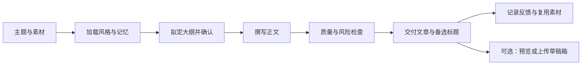

# 文章写作skill

面向微信公众号与长文创作者的 AI 写作工作流，将选题、结构设计、风格学习、素材复用、质量检查和交付整理为可复用的 Skill。

适合持续运营公众号的个人创作者、内容编辑与小型团队。你提供主题、观点或素材，AI 按既定流程协助完成文章，并将可复用经验保存在本地文件中。

**正式分发版本：v1.0.0** · [版本下载](https://github.com/zhuy3075-ui/article-writing-skill/releases/tag/v1.0.0) · [使用指南](docs/USER_GUIDE.md) · [工作流说明](WORKFLOW.md)

## 解决哪些问题

| 常见问题 | 对应能力 |
| --- | --- |
| 素材很多，难以确定文章切入点 | 梳理主题、选题角度与结构，先确认大纲再写正文 |
| AI 文章套话多，语气与自己的账号不一致 | 使用风格档案约束表达，并通过规则检查定位需要修改的段落 |
| 每次写作都要重复解释偏好 | 用本地记忆文件记录读者画像、反馈、标题与素材 |
| 写完还要整理标题、摘要和不同输出格式 | 按工作流准备交付内容，脚本支持 Markdown、JSON 与微信直贴文本 |
| 发布后缺少复盘依据 | 根据用户提供的阅读与互动数据形成改进建议 |

## 功能范围

- **文章结构**：提供干货、观点、故事、清单、热点、产品体验、工具分享、现象解读、调查实验共 9 类模板。
- **风格学习**：从用户提供的范文提取结构与表达特征，生成可复用的风格档案；支持按主题推荐风格。
- **素材与记忆**：记录选题、标题、金句、素材、读者画像和反馈，提供标题、素材与金句的 CSV 导出脚本。
- **质量检查**：启发式评估素材重合、套话、来源痕迹和句段节奏，为定向修改提供线索。
- **内容适配**：通过 Agent 工作流协助改写为小红书笔记、知乎回答或短视频口播。
- **可选交付工具**：生成配图、预览微信排版 HTML、将文章上传至公众号草稿箱；外部服务需要单独配置。

写作、学习、复盘等能力由支持 Skill 的 AI Agent 执行。这个仓库包含流程、参考资料和辅助脚本；仅下载文件不会自动启动写作或后台任务。

## 工作流程



## 快速开始

### 1. 获取正式版本

从 [GitHub Releases](https://github.com/zhuy3075-ui/article-writing-skill/releases) 下载 `v1.0.0` 的 Source code，或运行：

```bash
git clone --branch v1.0.0 --depth 1 https://github.com/zhuy3075-ui/article-writing-skill.git
```

### 2. 安装或加载 Skill

将仓库内完整的 `wechatskill/` 目录复制到所使用 Agent 的技能目录，保留内部目录结构。让 Agent 读取其中的 [SKILL.md](SKILL.md)，并按该流程处理写作请求。具体的目录位置与加载方式以所用客户端为准。

不支持技能目录的工具，可读取 [独立提示词](prompts/prompt.md)，并提供需要的风格、模板和素材；本地脚本与记忆回写仍需要文件访问能力。

### 3. 给出第一条写作请求

```text
写一篇观点型公众号文章，主题是：AI 工具越来越多，为什么内容创作者反而更累？
用理性派风格，结合我下面的素材，先给 5 个标题和大纲，确认后再写正文。
```

其他常用请求：

```text
学习这篇范文，只提取结构和表达特征。作者是：……
把下面的素材写成故事型公众号文章，保留真实事实，重新组织表达。
根据我提供的最近 10 篇文章数据，列出 3 个优先改进动作。
把这篇公众号文章改写成 60 秒短视频口播。
```

`SKILL.md` 中的 `/wechat-writer` 表示命令式调用约定，客户端是否支持该命令取决于其加载机制；自然语言请求可作为通用入口。

## 辅助脚本

以下命令在 `wechatskill/` 目录执行。脚本使用 Python 3.10 及以上语法；纯写作请求无需先安装 Python 或 API 依赖。

```bash
cd article-writing-skill/wechatskill
python scripts/style_recommender.py --list-only
python scripts/style_recommender.py --content "AI 工具与创作者效率" --article-type 观点
python scripts/originality_quality_gate.py --article examples/干货型示例.md
python scripts/article_output_formatter.py --input examples/干货型示例.md --output outputs/demo --mode both
```

质量闸门默认阈值为：原创度 ≥ 70、AI 味 ≤ 30、人味 ≥ 60。评分基于当前文件和规则特征，不是全网查重、可靠的 AI 检测、事实核查或平台审核结果。脚本会输出 `passed: True/False`；当前实现不通过退出码区分评分通过与否，调用方需读取该字段。

### 可选：配图与微信草稿箱

安装这些脚本使用的依赖：

```bash
python -m pip install requests PyYAML Pillow mistune premailer aiohttp
```

复制 `config/image-gen.local.yaml.example` 为 `config/image-gen.local.yaml`，或复制 `config/wechat.local.yaml.example` 为 `config/wechat.local.yaml`，再在本地填写凭证。配置说明见 [config/README.md](config/README.md)。

```bash
python scripts/publish_wechat.py --help
python scripts/publish_wechat.py --article examples/干货型示例.md --preview
python scripts/publish_wechat.py --validate
```

微信脚本上传至**草稿箱**，不会直接向读者群发。实际上传取决于账号接口权限、凭证与网络配置。配图脚本使用配置中指定的第三方 API，其可用模型与计费以服务提供方为准。

## 仓库结构

```text
article-writing-skill/
├── README.md                 # 对外说明与快速开始
├── CHANGELOG.md              # 正式版本记录
├── VERSION                   # 分发版本号
└── wechatskill/
    ├── SKILL.md              # 主入口与工作流程
    ├── core/                 # 默认表达设定与偏好演进规则
    ├── rules/                # 写作、排版、选题与风险检查规则
    ├── templates/            # 9 类文章模板
    ├── styles/               # 风格参考档案
    ├── memory/               # 选题、素材、反馈与效果记录
    ├── learning/             # 范文分析方法
    ├── prompts/              # 可复用提示词
    ├── scripts/              # 质量检查、格式转换与可选 API 工具
    ├── config/               # 空凭证模板与本地配置示例
    ├── examples/             # 示例文章
    └── docs/                 # 使用与开发文档
```

## 使用与升级说明

首次使用时检查已有 `memory/`、`styles/` 和 `core/personality.md`：仓库包含预置参考内容与学习记录，并非空白的个人记忆库。数据和案例需要在实际写作前重新核实。

升级前备份自己的记忆、风格档案和本地配置。`scripts/sync-to-local.sh` 可在 Bash 环境中增量同步，并保护 `memory/`、`styles/` 与 `learning/samples/`；它不保护 `core/personality.md`。Windows 用户需使用 Git Bash、WSL 等 Bash 环境，或手动合并文件。

真实 API 密钥应仅存于被忽略的 `config/*.local.yaml` 中。个人文章、反馈与范文原文属于使用者自己的数据；共享仓库前需检查这些内容。风险检查提供编辑线索，最终内容由发布者审核。

## 版本与许可

`v1.0.0` 为本仓库首次正式分发版本，版本号表示发布快照，不表示每个既有模块的内部版本。GitHub Release 中的版本记录 记录分发变化，后续正式版本以 GitHub Release 为准。

原始目录及其所属聚合仓库未声明统一开源许可证，本次公开发布不额外授予商业使用或再分发权利。风格参考与素材保留原有来源标记，引用内容仍应尊重原作者的权利。

## 文档导航

- [Skill 主入口](SKILL.md)
- [用户操作指南](docs/USER_GUIDE.md)
- [完整工作流程](WORKFLOW.md)
- [开发者说明](docs/README.dev.md)
- [示例文章](examples/干货型示例.md)
- [配置说明](config/README.md)
